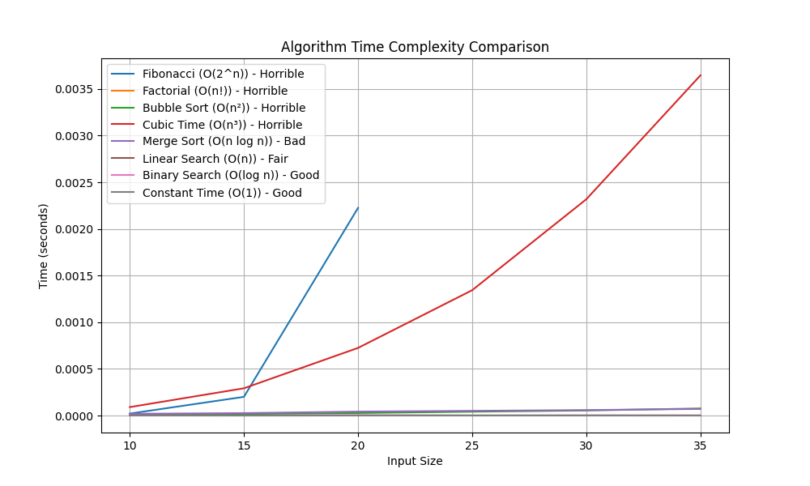

# Big-O Demonstrator: Visualizing Algorithm Time Complexities

This Python project demonstrates the time complexities of various algorithms by measuring and visualizing their execution times with different input sizes. It compares algorithms like Bubble Sort, Merge Sort, Fibonacci, and more, showing how their performance changes with input size.

## Key Features:
- **Algorithm Time Complexity Comparison**: Visualize and compare the performance of algorithms with different time complexities: `O(1)`, `O(n)`, `O(n²)`, `O(n³)`, `O(n log n)`, `O(2^n)`, and `O(n!)`.
- **Execution Time Measurement**: Measure and plot the execution times of algorithms as input size increases.
- **Real-Time Comparison**: Display a summary table showing the execution times for each algorithm along with a performance classification.

---

## Example Execution:

This table summarizes the expected output for various algorithms with different input sizes:

| Algorithm                    | Input Size  | Execution Time (s) | Tag     |
|------------------------------|-------------|--------------------|---------|
| `Bubble Sort (O(n²))`         | 10          | 0.000010           | Horrible|
| `Cubic Time (O(n³))`          | 10          | 0.000083           | Horrible|
| `Fibonacci (O(2^n))`          | 10          | 0.000018           | Horrible|
| `Factorial (O(n!))`           | 10          | 0.000002           | Horrible|
| `Merge Sort (O(n log n))`     | 10          | 0.000017           | Bad     |
| `Linear Search (O(n))`        | 10          | 0.000001           | Fair    |
| `Binary Search (O(log n))`    | 10          | 0.000001           | Good    |
| `Constant Time (O(1))`        | 10          | 0.000000           | Good    |

---

## Screenshot:


---

## Setup and Installation

### Clone the Repository

First, clone the repository to your local machine:

```bash
git clone https://github.com/Jonahida/Big-O-Demonstrator
cd Big-O-Demonstrator
```

### Create Virtual Environment and Install Dependencies

```bash
python3.9 -m venv env39
source env39/bin/activate
pip3 install -r requirements.txt
```

### Run the Script

To visualize and compare the time complexities, simply run the `big_o_demonstrator.py` script:

```bash
python big_o_demonstrator.py
```

The script will measure and print the execution times for the various algorithms and plot a graph comparing their performance.

### Example Output:

After running the script, you’ll see a table with the execution times (in seconds) for each algorithm and input size, along with a graph comparing the time complexities of the algorithms.


| Algorithm                      | Input Size  | Execution Time (s) |
|---------------------------------|-------------|--------------------|
| `Bubble Sort (O(n²))`           | 10          | 0.000010           |
| `Cubic Time (O(n³))`            | 10          | 0.000091           |
| `Merge Sort (O(n log n))`       | 10          | 0.000019           |
| `Linear Search (O(n))`          | 10          | 0.000001           |
| `Binary Search (O(log n))`      | 10          | 0.000001           |
| `Constant Time (O(1))`          | 10          | 0.000001           |
| `Fibonacci (O(2^n))`            | 10          | 0.000021           |
| `Factorial (O(n!))`             | 10          | 0.000002           |
|---------------------------------|-------------|--------------------|
| `Bubble Sort (O(n²))`           | 15          | 0.000017           |
| `Cubic Time (O(n³))`            | 15          | 0.000292           |
| `Merge Sort (O(n log n))`       | 15          | 0.000026           |
| `Linear Search (O(n))`          | 15          | 0.000001           |
| `Binary Search (O(log n))`      | 15          | 0.000000           |
| `Constant Time (O(1))`          | 15          | 0.000000           |
| `Fibonacci (O(2^n))`            | 15          | 0.000201           |
|---------------------------------|-------------|--------------------|
| `Bubble Sort (O(n²))`           | 20          | 0.000027           |
| `Cubic Time (O(n³))`            | 20          | 0.000725           |
| `Merge Sort (O(n log n))`       | 20          | 0.000042           |
| `Linear Search (O(n))`          | 20          | 0.000003           |
| `Binary Search (O(log n))`      | 20          | 0.000002           |
| `Constant Time (O(1))`          | 20          | 0.000000           |
| `Fibonacci (O(2^n))`            | 20          | 0.002226           |
|---------------------------------|-------------|--------------------|

### Summary of Time Complexities:

| Algorithm                     | Time Complexity | Classification |
|-------------------------------|-----------------|----------------|
| `Bubble Sort (O(n²))`          | O(n²)           | Horrible       |
| `Cubic Time (O(n³))`           | O(n³)           | Horrible       |
| `Fibonacci (O(2^n))`           | O(2^n)          | Horrible       |
| `Factorial (O(n!))`            | O(n!)           | Horrible       |
| `Merge Sort (O(n log n))`      | O(n log n)      | Bad            |
| `Linear Search (O(n))`         | O(n)            | Fair           |
| `Binary Search (O(log n))`     | O(log n)        | Good           |
| `Constant Time (O(1))`         | O(1)            | Good           |

## How the Script Works

### Algorithms Demonstrated:
The script demonstrates several common algorithms with different time complexities:

- **Bubble Sort (O(n²))**: A simple comparison-based sorting algorithm with quadratic time complexity.
- **Merge Sort (O(n log n))**: A divide-and-conquer sorting algorithm with a better time complexity than bubble sort.
- **Fibonacci (O(2^n))**: A recursive algorithm to calculate Fibonacci numbers, demonstrating exponential growth in execution time.
- **Factorial (O(n!))**: A recursive algorithm for calculating factorials, showing a steep rise in execution time as input grows.
- **Linear Search (O(n))**: A simple search algorithm that scans each element in a list, representing linear time complexity.
- **Binary Search (O(log n))**: A faster search algorithm for sorted lists, demonstrating logarithmic time complexity.
- **Constant Time (O(1))**: A trivial algorithm that performs a constant-time operation (accessing the first element of a list).
- **Cubic Time (O(n³))**: A simple algorithm demonstrating cubic time complexity through nested loops.

### Time Complexity Measurement:
For each algorithm, the script generates random input sizes (10, 15, 20, 25, 30, 35 elements) and measures the execution time for each input size. The results are then displayed in a table format and plotted to compare the performance of the algorithms.

### Plotting the Results:
The script plots the execution times for each algorithm against the input size. The chart allows a clear visual comparison of how different time complexities scale with increasing input sizes. The following algorithms are included in the plot:
- Bubble Sort
- Merge Sort
- Fibonacci
- Factorial
- Linear Search
- Binary Search
- Constant Time
- Cubic Time

### Execution Flow:
1. **Data Generation**: Random data is generated for each input size.
2. **Time Measurement**: The script uses `measure_time`to capture the execution times.
3. **Output**: A table of execution times is printed.
4. **Visualization**: The results are plotted using `matplotlib` to visually compare the performance of the algorithms.

### License:
This project is licensed under the MIT License. See the [LICENSE](LICENSE) file for more details.

